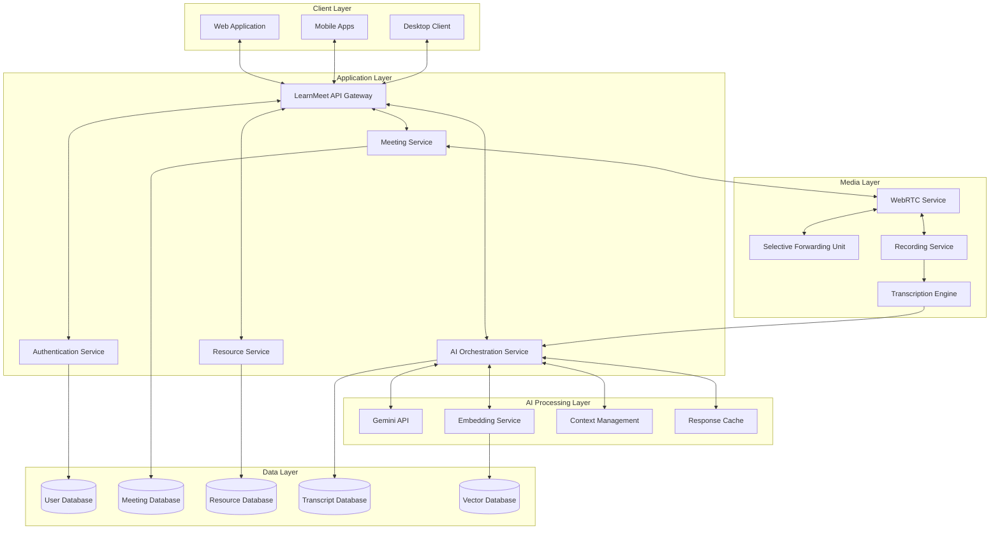
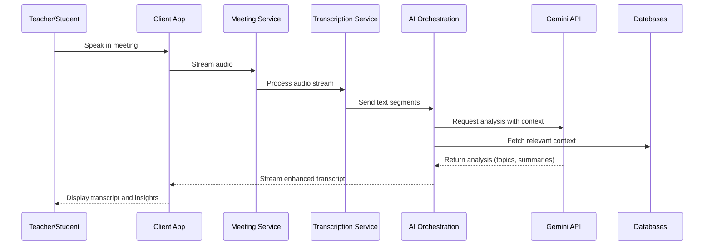
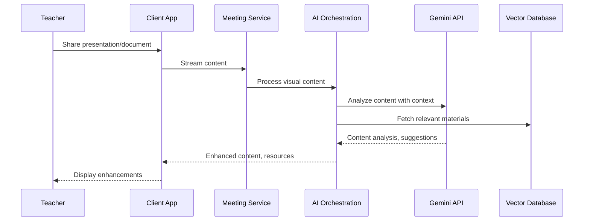

# AI Integration Architecture for LearnMeet

## Overview

This document outlines the integration of Gemini API into the LearnMeet platform to enhance the online learning experience with advanced AI capabilities. The architecture focuses on providing real-time AI assistance for teachers and students while maintaining performance, privacy, and reliability.

## Architecture Diagram

## Component Details

### AI Orchestration Service

The AI Orchestration Service is the central hub for managing all AI-related functionality within LearnMeet. It coordinates between various AI subsystems and the rest of the application.

Key responsibilities:
- Managing API calls to Gemini and other AI services
- Handling request prioritization and rate limiting
- Providing a unified API for other services to access AI capabilities
- Maintaining context for conversation-based interactions
- Monitoring AI usage and performance

### Gemini API Integration

The Gemini API provides the core multimodal AI capabilities to LearnMeet.

Integration points:
1. **Meeting Transcription and Analysis**
   - Real-time transcription of speech
   - Speaker identification
   - Topic extraction and summarization
   - Question detection and highlighting

2. **Content Understanding**
   - Slide and document analysis
   - Whiteboard content recognition
   - Visual aid interpretation

3. **Educational Support**
   - Automatic question answering
   - Resource recommendation
   - Explanation generation at different levels

4. **Translation and Accessibility**
   - Real-time translation of speech and text
   - Caption generation
   - Content simplification and explanation

### Vector Database for Knowledge Storage

A vector database stores embeddings of course materials, past lectures, and resources to enable semantic search and context-aware AI assistance.

Features:
- Document embeddings for semantic similarity search
- Lecture transcription indexing
- Incremental learning from new content
- Fast retrieval for real-time assistance

### Context Management System

Maintains conversational and educational context across sessions to provide more relevant and personalized AI responses.

Components:
- User profile context (knowledge level, preferences)
- Course context (topic, materials, learning objectives)
- Conversation history with windowing
- Activity tracking for personalization

## Data Flow

### Meeting Transcription and Analysis Flow

### Content Enhancement Flow

## Security and Privacy Considerations

### Data Handling

1. **Privacy-First Design**
   - Only necessary data sent to Gemini API
   - Option to disable specific AI features
   - Anonymization of student data in API calls
   - Data retention policies enforced

2. **Model Security**
   - API key secure storage and rotation
   - Request signing and validation
   - Rate limiting and abuse prevention
   - Access auditing and logging

### Compliance

1. **Educational Standards**
   - FERPA compliance for student data
   - GDPR compliance for user privacy
   - Accessibility standards (WCAG 2.1 AA)

2. **Transparency**
   - Clear indication when AI is being used
   - User control over AI feature usage
   - Documentation of AI data processing practices
   - Options to export or delete AI-generated content

## Performance Optimization

### Real-time Capabilities

1. **Streaming API Usage**
   - Chunked responses for real-time feedback
   - Progressive rendering of AI-generated content
   - Parallel processing pipelines for audio, video, and text

2. **Caching Strategy**
   - Response caching for common queries
   - Embedding caching for frequently accessed documents
   - Context preloading for scheduled meetings
   - Session-based optimization

### Scalability Considerations

1. **Load Management**
   - Queue-based processing for non-critical tasks
   - AI feature prioritization during high load
   - Graceful degradation of AI features when needed
   - Resource allocation based on meeting importance

2. **Distributed Processing**
   - Edge processing for latency-sensitive features
   - Centralized processing for context-dependent tasks
   - Batch processing for post-meeting analysis
   - Regional optimization for global deployment

## Implementation Approach

### Phase 1: Foundation

1. **Basic Integration**
   - API connectivity and authentication
   - Simple prompt templates for key functions
   - Base context management
   - Initial performance monitoring

2. **Core Educational Features**
   - Meeting transcription and summarization
   - Basic question detection
   - Simple content enhancement

### Phase 2: Advanced Features

1. **Enhanced Context Awareness**
   - Full course material integration
   - Personal learning profiles
   - Adaptive response generation
   - Cross-session context preservation

2. **Multimodal Processing**
   - Complete visual content understanding
   - Audio sentiment analysis
   - Combined modality insights
   - Interactive AI assistance

### Phase 3: Optimization and Scale

1. **Performance Tuning**
   - Prompt optimization for efficiency
   - Caching and prediction improvements
   - Context compression techniques
   - Bandwidth and compute optimization

2. **Advanced Educational Intelligence**
   - Learning pattern recognition
   - Personalized content recommendations
   - Engagement optimization
   - Outcome prediction and intervention

## Monitoring and Evaluation

### Quality Metrics

1. **AI Response Quality**
   - Relevance scoring
   - Hallucination detection
   - Educational value assessment
   - User satisfaction ratings

2. **Performance Metrics**
   - Response time tracking
   - Token usage efficiency
   - Cache hit rates
   - Resource utilization

### Feedback Loops

1. **User Feedback Collection**
   - Explicit feedback mechanisms
   - Implicit usage pattern analysis
   - A/B testing framework
   - Continuous improvement process

2. **Model Fine-Tuning**
   - Training data collection (with consent)
   - Domain-specific optimization
   - Custom prompt template refinement
   - Feature prioritization based on usage

## Technical Requirements

1. **Gemini API**
   - API Key management
   - Version tracking
   - Usage monitoring
   - Quota management

2. **Infrastructure**
   - High-throughput message queuing
   - Low-latency database access
   - Scalable compute resources
   - High-availability configuration

3. **Development Tools**
   - Prompt testing framework
   - Performance simulation tools
   - Integration test suite
   - Monitoring dashboards

## Conclusion

The AI integration architecture for LearnMeet leverages the power of Gemini API to create an intelligent educational platform that enhances teaching and learning experiences. By carefully designing the system with privacy, performance, and educational value in mind, LearnMeet can offer AI-enhanced features that truly support the pedagogical goals of the platform while maintaining performance at scale.
