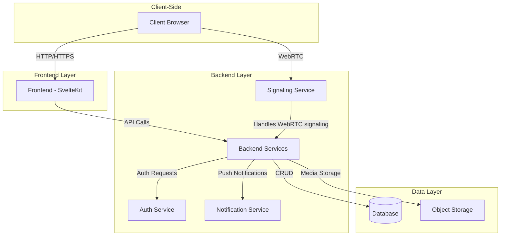
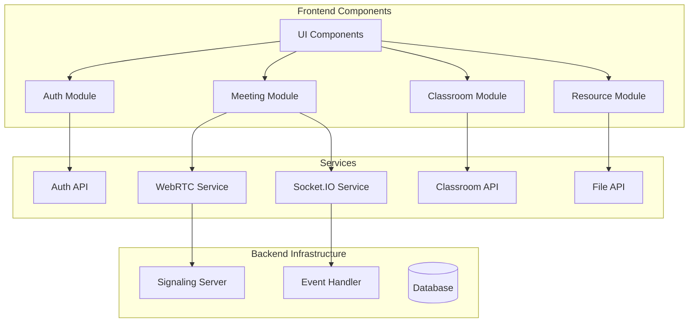
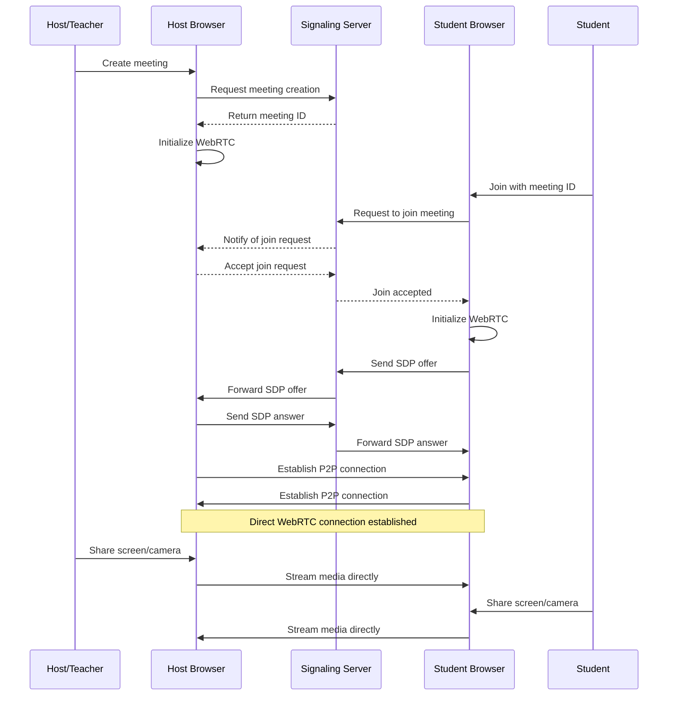
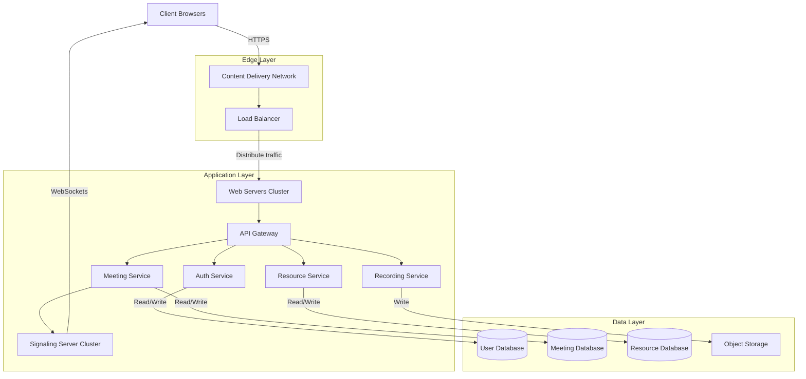

# LearnMeet System Architecture

## High-Level Architecture

```mermaid
graph TD
    Client[Client Browser] --> |HTTP/HTTPS| FE[Frontend - SvelteKit]
    Client --> |WebRTC| PS[Signaling Service]
    FE --> |API Calls| BE[Backend Services]
    BE --> |CRUD| DB[(Database)]
    BE --> |Auth Requests| Auth[Auth Service]
    PS --> |Handles WebRTC signaling| BE
    BE --> |Media Storage| S3[Object Storage]
    BE --> |Push Notifications| NS[Notification Service]
    
    subgraph "Client-Side"
        Client
    end
    
    subgraph "Frontend Layer"
        FE
    end
    
    subgraph "Backend Layer"
        BE
        PS
        Auth
        NS
    end
    
    subgraph "Data Layer"
        DB
        S3
    end
```

## Component Architecture

```mermaid
graph TD
    UI[UI Components] --> Auth[Auth Module]
    UI --> Meeting[Meeting Module]
    UI --> Classroom[Classroom Module]
    UI --> Resource[Resource Module]
    
    Auth --> AuthAPI[Auth API]
    Meeting --> WebRTC[WebRTC Service]
    Meeting --> Socket[Socket.IO Service]
    Classroom --> ClassAPI[Classroom API]
    Resource --> FileAPI[File API]
    
    WebRTC --> Signaling[Signaling Server]
    Socket --> EventHandler[Event Handler]
    
    subgraph "Frontend Components"
        UI
        Auth
        Meeting
        Classroom
        Resource
    end
    
    subgraph "Services"
        WebRTC
        Socket
        AuthAPI
        ClassAPI
        FileAPI
    end
    
    subgraph "Backend Infrastructure"
        Signaling
        EventHandler
        DB[(Database)]
    end
```

## Data Flow for Video Conferencing

```mermaid
sequenceDiagram
    participant User1 as Host/Teacher
    participant Client1 as Host Browser
    participant Server as Signaling Server
    participant Client2 as Student Browser
    participant User2 as Student
    
    User1->>Client1: Create meeting
    Client1->>Server: Request meeting creation
    Server-->>Client1: Return meeting ID
    Client1->>Client1: Initialize WebRTC
    
    User2->>Client2: Join with meeting ID
    Client2->>Server: Request to join meeting
    Server-->>Client1: Notify of join request
    Client1-->>Server: Accept join request
    Server-->>Client2: Join accepted
    
    Client2->>Client2: Initialize WebRTC
    Client2->>Server: Send SDP offer
    Server->>Client1: Forward SDP offer
    Client1->>Server: Send SDP answer
    Server->>Client2: Forward SDP answer
    
    Client1->>Client2: Establish P2P connection
    Client2->>Client1: Establish P2P connection
    
    Note over Client1, Client2: Direct WebRTC connection established
    
    User1->>Client1: Share screen/camera
    Client1->>Client2: Stream media directly
    User2->>Client2: Share screen/camera
    Client2->>Client1: Stream media directly
```

## Deployment Architecture

```mermaid
graph TD
    Client[Client Browsers] --> |HTTPS| CDN[Content Delivery Network]
    CDN --> LB[Load Balancer]
    LB --> |Distribute traffic| WebServer[Web Servers Cluster]
    WebServer --> API[API Gateway]
    
    API --> AuthS[Auth Service]
    API --> MeetingS[Meeting Service]
    API --> ResourceS[Resource Service]
    API --> RecordingS[Recording Service]
    
    AuthS --> |Read/Write| UserDB[(User Database)]
    MeetingS --> |Read/Write| MeetingDB[(Meeting Database)]
    ResourceS --> |Read/Write| ResourceDB[(Resource Database)]
    RecordingS --> |Write| ObjectS[Object Storage]
    
    MeetingS --> SignalServer[Signaling Server Cluster]
    SignalServer --> |WebSockets| Client
    
    subgraph "Edge Layer"
        CDN
        LB
    end
    
    subgraph "Application Layer"
        WebServer
        API
        AuthS
        MeetingS
        ResourceS
        RecordingS
        SignalServer
    end
    
    subgraph "Data Layer"
        UserDB
        MeetingDB
        ResourceDB
        ObjectS
    end
```
