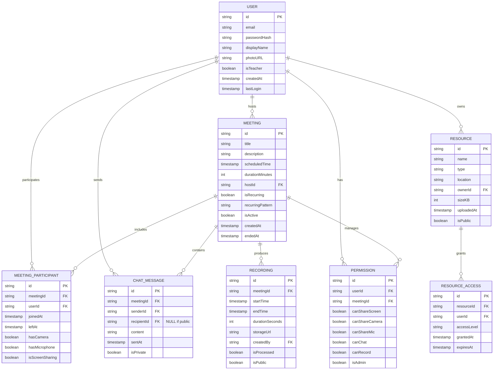

# Database Schema Design

## Entity-Relationship Diagram (ERD)



## Schema Implementation Notes

### Users Collection

```javascript
{
  id: "user123",
  email: "teacher@example.com",
  displayName: "Professor Smith",
  photoURL: "https://storage.example.com/profiles/user123.jpg",
  isTeacher: true,
  passwordHash: "$2a$10$...", // Bcrypt hash
  createdAt: "2025-04-10T15:00:00Z",
  lastLogin: "2025-05-12T09:30:00Z",
  preferences: {
    theme: "light",
    notifications: {
      email: true,
      inApp: true
    }
  },
  institutionId: "inst456"
}
```

### Meetings Collection

```javascript
{
  id: "meet789",
  title: "Introduction to Computer Science",
  description: "First lecture of the semester covering course overview",
  scheduledTime: "2025-05-15T14:00:00Z",
  durationMinutes: 90,
  hostId: "user123",
  isRecurring: true,
  recurringPattern: "WEEKLY",
  isActive: false,
  createdAt: "2025-05-01T10:00:00Z",
  endedAt: null,
  settings: {
    waitingRoom: true,
    recordingEnabled: true,
    chatEnabled: true
  },
  courseId: "cs101",
  meetingUrl: "https://learnmeet.com/join/meet789",
  password: "class2025" // Optional password protection
}
```

### Meeting Participants Collection

```javascript
{
  id: "mp456",
  meetingId: "meet789",
  userId: "student456",
  joinedAt: "2025-05-15T14:02:30Z",
  leftAt: "2025-05-15T15:30:00Z",
  hasCamera: true,
  hasMicrophone: true,
  isScreenSharing: false,
  deviceInfo: {
    browser: "Chrome 120.0",
    os: "Windows 11",
    networkQuality: "good"
  },
  connectionQuality: 85 // Percentage
}
```

### Chat Messages Collection

```javascript
{
  id: "msg123",
  meetingId: "meet789",
  senderId: "student456",
  recipientId: null, // null means public message
  content: "Could you explain the last slide again?",
  sentAt: "2025-05-15T14:45:30Z",
  isPrivate: false,
  isQuestion: true,
  isAnswered: false,
  reactions: ["👍", "👍"] // Reactions from other participants
}
```

### Resources Collection

```javascript
{
  id: "res789",
  name: "Lecture Slides Week 1.pdf",
  type: "application/pdf",
  location: "storage/courses/cs101/slides/week1.pdf",
  ownerId: "user123",
  sizeKB: 2048,
  uploadedAt: "2025-05-10T11:30:00Z",
  isPublic: false,
  metadata: {
    pageCount: 45,
    thumbnail: "thumbnails/res789.jpg"
  },
  tags: ["introduction", "week1"]
}
```

### Recordings Collection

```javascript
{
  id: "rec123",
  meetingId: "meet789",
  startTime: "2025-05-15T14:00:00Z",
  endTime: "2025-05-15T15:30:00Z",
  durationSeconds: 5400,
  storageUrl: "storage/recordings/meet789/rec123.mp4",
  createdBy: "user123",
  isProcessed: true,
  isPublic: false,
  format: "mp4",
  resolution: "720p",
  sizeKB: 102400,
  chapters: [
    { title: "Introduction", timestamp: 0 },
    { title: "Course Overview", timestamp: 600 },
    { title: "Q&A Session", timestamp: 3600 }
  ],
  transcription: "storage/recordings/meet789/rec123-transcript.txt"
}
```
