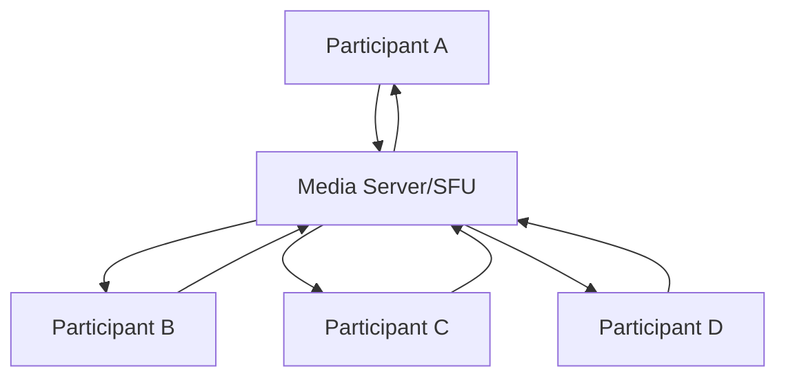
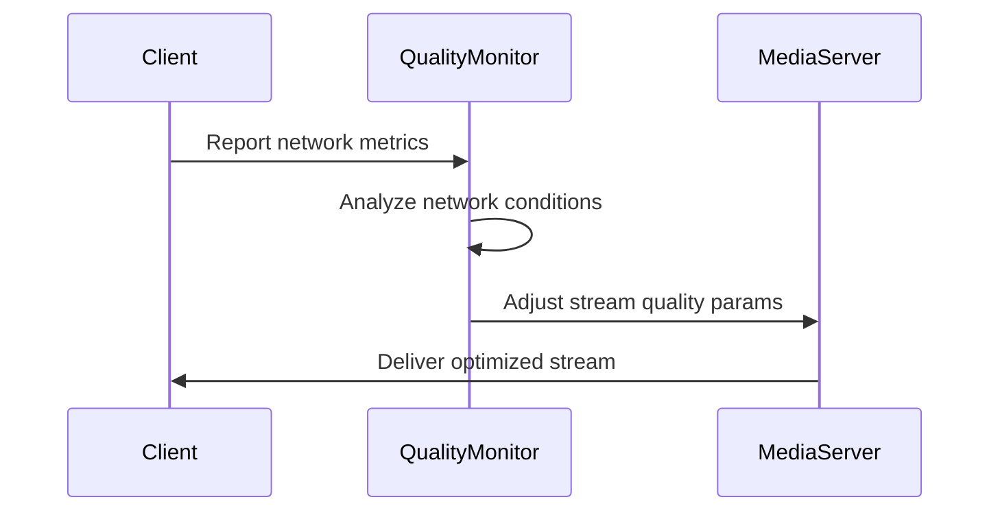
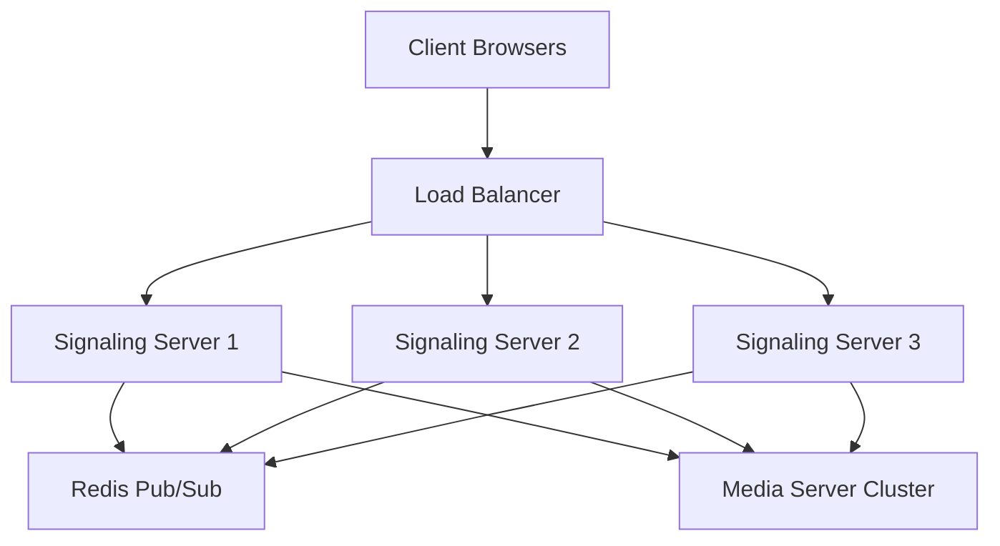
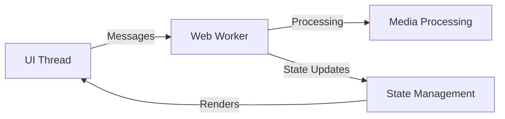
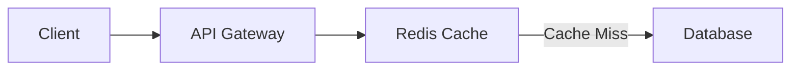

# High Concurrency Strategy for LearnMeet

## Introduction

LearnMeet is expected to handle educational scenarios with high concurrent users (CCU), potentially reaching hundreds of users in a single session for large classes. This document outlines the strategies and architectural considerations to ensure performance, reliability, and user experience under high load.

## Current Challenges

1. **WebRTC Scaling**: WebRTC connections create a mesh network that grows exponentially with participant count
2. **Signaling Server Load**: High message volume during participant join/leave events
3. **Bandwidth Constraints**: Video streams consume significant bandwidth
4. **Client-side Performance**: Multiple video streams can overwhelm client devices
5. **Server Resource Management**: Need to efficiently handle thousands of concurrent connections

## Architecture for High CCU

### 1. Selective Stream Forwarding

Instead of a full mesh topology where every participant connects to every other participant (which scales as O(n²)), we'll implement a Selective Forwarding Unit (SFU) approach:



**Benefits:**
- Reduces client-side connection management
- Centralizes stream distribution
- Allows intelligent stream selection

**Implementation:**
- Use Mediasoup or similar WebRTC SFU
- Deploy multiple SFU instances with load balancing
- Implement regional SFU deployment for reduced latency

### 2. Dynamic Stream Quality Management



**Strategy:**
1. Monitor client bandwidth, CPU usage, and network conditions
2. Dynamically adjust:
   - Resolution (1080p → 720p → 480p → 360p)
   - Frame rate (30fps → 15fps → 10fps)
   - Bitrate
3. Prioritize active speaker streams

**Implementation:**
- Client-side bandwidth estimation
- Server-side stream transcoding for bandwidth-constrained clients
- Quality of Service (QoS) policies

### 3. Tiered Participant Management

For very large sessions (50+ participants):

```
+----------------------------------+
| Active Participants (Video On)   |
|  +--------+  +--------+          |
|  |Speaker |  |Speaker |          |
|  +--------+  +--------+          |
+----------------------------------+
| Secondary Tier (Thumbnail Video) |
|  +---+ +---+ +---+ +---+ +---+   |
|  |   | |   | |   | |   | |   |   |
|  +---+ +---+ +---+ +---+ +---+   |
+----------------------------------+
| Inactive Tier (Names Only)       |
|  - User 1                        |
|  - User 2                        |
|  - User 3                        |
+----------------------------------+
```

**Implementation:**
1. Display only active speakers in full video
2. Show a limited number of participants (5-10) with thumbnail videos
3. List remaining participants without video
4. Implement "raise hand" feature to request speaking time
5. Allow presenter to promote participants to active tier

### 4. Backend Scalability Considerations



**Implementation:**
1. **Horizontal scaling** of signaling servers
   - Stateless design where possible
   - Session affinity for WebSocket connections
   - Redis or similar for shared state

2. **Geographic distribution**
   - Deploy servers in multiple regions
   - Route users to nearest datacenter
   - Edge computing for reduced latency

3. **Graceful degradation**
   - Reduce video quality under heavy load
   - Fallback to audio-only mode
   - Disable non-essential features

### 5. Optimized Client Architecture



**Implementation:**
1. Offload heavy processing to Web Workers
2. Use efficient rendering strategies
   - Virtual lists for participant display
   - Throttle UI updates
   - Canvas-based rendering for multiple videos
3. Browser resource management
   - Pause inactive video streams
   - Unload background tabs/windows
   - Monitor and respond to device thermal state

## Database Considerations

### Sharding Strategy

```
User Data → User Shard
Meeting Data → Meeting Shard (by meeting ID)
Analytics → Time-based Sharding
```

**Implementation:**
1. Partition data by natural boundaries
2. Use distributed database systems
3. Implement read replicas for analytics
4. Time-series data management for metrics

### Caching Layer



**Implementation:**
1. Multi-level caching strategy
   - Browser cache
   - CDN cache
   - Application cache
   - Database cache
2. Cache invalidation strategies
3. Optimistic UI updates

## Real-world Performance Testing

### Testing Methodology

1. **Load testing**
   - Simulate 100-1000 concurrent users
   - Measure response times, error rates, and resource usage
   - Identify bottlenecks

2. **Chaos engineering**
   - Simulate network partition events
   - Test with packet loss and high latency
   - Server failure scenarios

3. **Long-running tests**
   - 8+ hour sessions with fluctuating user counts
   - Memory leak detection
   - Connection stability monitoring

## Monitoring and Alerting

### Key Metrics

1. **System metrics**
   - CPU, memory, network utilization
   - Request queue lengths
   - Error rates and types

2. **WebRTC specific**
   - Packet loss
   - Jitter
   - Connection setup time
   - ICE candidate gathering time

3. **User experience**
   - Time to interactive
   - Video freeze frequency
   - Audio quality score

### Real-time Dashboards

```
+-----------------------------+  +-----------------------------+
| Active Users                |  | Error Rate                  |
| [Graph of users over time]  |  | [Graph of errors over time] |
+-----------------------------+  +-----------------------------+
| Server Load                 |  | Network Metrics             |
| [CPU/Memory usage]          |  | [Bandwidth/Packet loss]     |
+-----------------------------+  +-----------------------------+
| Active Meetings             |  | Geographic Distribution     |
| [Count by size]             |  | [Map of user locations]     |
+-----------------------------+  +-----------------------------+
```

## Performance Optimization Checklist

1. **Network Optimization**
   - [ ] HTTP/3 and QUIC support
   - [ ] WebTransport for data channels
   - [ ] Bandwidth estimation and adaptation
   - [ ] Traffic prioritization (audio > video > screen share > chat)

2. **Media Optimization**
   - [ ] Hardware acceleration for encoding/decoding
   - [ ] VP9/AV1 codec support with fallbacks
   - [ ] Simulcast for quality layers
   - [ ] Background blur optimization

3. **Application Optimization**
   - [ ] Code splitting and lazy loading
   - [ ] Tree-shaking unused code
   - [ ] Memory management and leak prevention
   - [ ] Service worker for offline support

## Conclusion

Building for high concurrency requires a multi-faceted approach addressing network, server, client, and architectural concerns. By implementing these strategies, LearnMeet can provide a reliable and responsive experience even with hundreds of concurrent users in educational settings.
