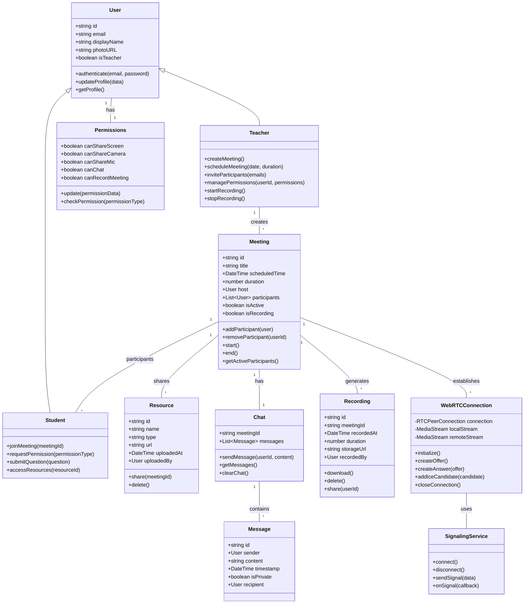

# Object-Oriented Design for LearnMeet

## Class Diagram



## Design Patterns Used

### 1. Factory Pattern
Used for creating different types of users (Teacher vs Student) and different types of resources.

```typescript
// User Factory
class UserFactory {
  static createUser(userData: UserData): User {
    if (userData.isTeacher) {
      return new Teacher(userData);
    } else {
      return new Student(userData);
    }
  }
}

// Resource Factory
class ResourceFactory {
  static createResource(type: string, data: any): Resource {
    switch (type) {
      case 'document':
        return new DocumentResource(data);
      case 'video':
        return new VideoResource(data);
      case 'quiz':
        return new QuizResource(data);
      default:
        throw new Error(`Unsupported resource type: ${type}`);
    }
  }
}
```

### 2. Observer Pattern
Used for real-time updates in meetings and chat.

```typescript
// Observer interface
interface Observer {
  update(data: any): void;
}

// Subject
class MeetingSubject {
  private observers: Observer[] = [];
  
  addObserver(observer: Observer): void {
    this.observers.push(observer);
  }
  
  removeObserver(observer: Observer): void {
    const index = this.observers.indexOf(observer);
    if (index !== -1) {
      this.observers.splice(index, 1);
    }
  }
  
  notify(data: any): void {
    for (const observer of this.observers) {
      observer.update(data);
    }
  }
}

// Concrete Observer example
class ParticipantView implements Observer {
  update(data: any): void {
    // Update UI with new participant data
    console.log('Participant update:', data);
  }
}
```

### 3. Singleton Pattern
Used for services like authentication, socket connections.

```typescript
// Authentication Singleton
class AuthService {
  private static instance: AuthService;
  private currentUser: User | null = null;
  
  private constructor() {}
  
  static getInstance(): AuthService {
    if (!AuthService.instance) {
      AuthService.instance = new AuthService();
    }
    return AuthService.instance;
  }
  
  async login(email: string, password: string): Promise<User> {
    // Authentication logic
    // ...
    return this.currentUser;
  }
  
  logout(): void {
    this.currentUser = null;
  }
  
  getCurrentUser(): User | null {
    return this.currentUser;
  }
}
```

### 4. Strategy Pattern
Used for different video/audio quality strategies based on network conditions.

```typescript
// Strategy interface
interface StreamQualityStrategy {
  configureStream(stream: MediaStream): MediaStream;
}

// Concrete strategies
class HighQualityStrategy implements StreamQualityStrategy {
  configureStream(stream: MediaStream): MediaStream {
    // Configure for high quality
    return stream;
  }
}

class LowBandwidthStrategy implements StreamQualityStrategy {
  configureStream(stream: MediaStream): MediaStream {
    // Reduce quality for low bandwidth
    return stream;
  }
}

// Context
class MediaStreamManager {
  private strategy: StreamQualityStrategy;
  
  setStrategy(strategy: StreamQualityStrategy): void {
    this.strategy = strategy;
  }
  
  configureStream(stream: MediaStream): MediaStream {
    return this.strategy.configureStream(stream);
  }
}
```

### 5. Proxy Pattern
Used for lazy loading of resources and access control.

```typescript
// Subject interface
interface ResourceAccess {
  getResourceContent(resourceId: string): Promise<any>;
}

// Real subject
class DirectResourceAccess implements ResourceAccess {
  async getResourceContent(resourceId: string): Promise<any> {
    // Fetch resource content directly
    return fetch(`/api/resources/${resourceId}`).then(r => r.json());
  }
}

// Proxy
class ResourceAccessProxy implements ResourceAccess {
  private realAccess: DirectResourceAccess = new DirectResourceAccess();
  private cache: Map<string, any> = new Map();
  private authService = AuthService.getInstance();
  
  async getResourceContent(resourceId: string): Promise<any> {
    // Check permissions
    const user = this.authService.getCurrentUser();
    if (!user) {
      throw new Error('Authentication required');
    }
    
    // Check cache
    if (this.cache.has(resourceId)) {
      return this.cache.get(resourceId);
    }
    
    // Get from real subject
    const content = await this.realAccess.getResourceContent(resourceId);
    
    // Cache the result
    this.cache.set(resourceId, content);
    
    return content;
  }
}
```
