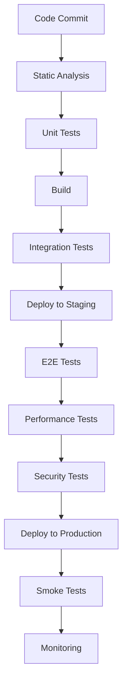

# Testing Strategy for LearnMeet

## Overview

This document outlines the comprehensive testing strategy for the LearnMeet platform. The goal is to ensure high quality, reliability, and performance across all features and components of the application.

## Testing Pyramid

Our testing approach follows the testing pyramid model to balance coverage, execution speed, and maintenance costs:

```
    /\
   /  \
  /    \
 / E2E  \
/--------\
/  INT    \
/----------\
/    UNIT    \
--------------
```

1. **Unit Tests**: Fast, focused tests for individual functions and components
2. **Integration Tests**: Testing how components work together
3. **End-to-End Tests**: Full workflow testing from the user perspective

## Test Types

### 1. Unit Testing

**Scope**: Individual functions, components, and modules

**Tools**:
- Vitest - Test runner
- Testing Library - Component testing
- MSW (Mock Service Worker) - API mocking

**Areas Covered**:
- UI Components
- Store operations
- Utility functions
- Service interfaces

**Example Test Cases**:
```typescript
// Button component test
test('Button renders correctly with props', () => {
  const { getByText } = render(Button, {
    props: {
      variant: 'primary',
      size: 'md'
    }
  });
  
  const button = getByText('Click me');
  expect(button).toBeInTheDocument();
  expect(button).toHaveClass('btn-primary');
  expect(button).toHaveClass('btn-md');
});

// Auth store test
test('authStore.signIn updates state correctly on success', async () => {
  // Mock API response
  const mockUser = { id: '123', email: 'test@example.com', displayName: 'Test User' };
  mockApi.onPost('/auth/login').reply(200, { user: mockUser });
  
  // Call the store action
  await authStore.signIn('test@example.com', 'password');
  
  // Get the final state
  const state = get(authStore);
  
  expect(state.user).toEqual(mockUser);
  expect(state.isAuthenticated).toBe(true);
  expect(state.loading).toBe(false);
  expect(state.error).toBe(null);
});
```

**Coverage Target**: 80% statement coverage

### 2. Integration Testing

**Scope**: Interactions between multiple components or services

**Tools**:
- Vitest
- Playwright Component Testing
- Pact (for API contract testing)

**Areas Covered**:
- Form submissions and validation
- Data flow between components
- API integrations
- State management across features

**Example Test Cases**:
```typescript
// Login form integration test
test('Login form submission calls API and updates UI', async () => {
  // Setup mocks
  mockApi.onPost('/auth/login').reply(200, { 
    user: { id: '123', email: 'test@example.com' }
  });
  
  // Render the form
  const { getByLabelText, getByRole } = render(LoginForm);
  
  // Fill out the form
  await userEvent.type(getByLabelText('Email'), 'test@example.com');
  await userEvent.type(getByLabelText('Password'), 'password');
  
  // Submit the form
  await userEvent.click(getByRole('button', { name: 'Sign In' }));
  
  // Check that API was called
  expect(mockApi.history.post).toHaveLength(1);
  
  // Check that UI updated appropriately
  await waitFor(() => {
    expect(getByRole('alert')).toHaveTextContent('Login successful');
  });
});
```

**Coverage Target**: 70% integration coverage of critical paths

### 3. End-to-End Testing

**Scope**: Full user workflows across the entire application

**Tools**:
- Playwright
- Cypress

**Areas Covered**:
- User registration and authentication
- Meeting creation and joining
- Video conferencing core functionality
- Resource sharing and management

**Example Test Cases**:
```typescript
// E2E test for meeting creation and joining
test('User can create a meeting and another user can join it', async ({ page, browser }) => {
  // Login as first user
  await page.goto('/login');
  await page.fill('[name="email"]', 'teacher@example.com');
  await page.fill('[name="password"]', 'password');
  await page.click('button[type="submit"]');
  
  // Create a new meeting
  await page.goto('/meetings/new');
  await page.fill('[name="title"]', 'Test Meeting');
  await page.click('button:has-text("Create Meeting")');
  
  // Get meeting URL
  const meetingUrl = await page.url();
  
  // Create second browser context and page
  const secondContext = await browser.newContext();
  const secondPage = await secondContext.newPage();
  
  // Login as second user
  await secondPage.goto('/login');
  await secondPage.fill('[name="email"]', 'student@example.com');
  await secondPage.fill('[name="password"]', 'password');
  await secondPage.click('button[type="submit"]');
  
  // Join the meeting
  await secondPage.goto(meetingUrl);
  
  // Verify both users are in the meeting
  await expect(page.locator('.participant')).toHaveCount(2);
  await expect(secondPage.locator('.participant')).toHaveCount(2);
});
```

**Coverage Target**: Cover all critical user workflows

### 4. Performance Testing

**Scope**: Application performance under various conditions

**Tools**:
- Lighthouse
- JMeter
- Custom WebRTC performance tools

**Areas Covered**:
- Page load times
- Time to interactive
- Video/audio quality metrics
- Concurrent user capacity

**Example Test Cases**:
```
// Load testing scenario
1. Simulate 50 concurrent users joining a meeting over 2 minutes
2. Each user sends/receives audio and video
3. Monitor server CPU, memory, bandwidth usage
4. Measure median and p95 latency for various operations
5. Verify no degradation in video quality
```

**Performance Targets**:
- First contentful paint < 1.5s
- Time to interactive < 3s
- Meeting join time < 5s
- Support 100 concurrent users per meeting
- Video latency < 500ms

### 5. Security Testing

**Scope**: Security vulnerabilities and data protection

**Tools**:
- OWASP ZAP
- SonarQube
- npm audit
- Penetration testing tools

**Areas Covered**:
- Authentication and authorization
- Input validation and sanitization
- Protection against common web vulnerabilities
- Data encryption at rest and in transit

**Example Test Cases**:
```
// Security test scenarios
1. Attempt to access protected resources without authentication
2. Test for SQL injection in search fields
3. Check for XSS vulnerabilities in chat messages
4. Verify proper TLS implementation
5. Test rate limiting on authentication endpoints
```

**Security Standards**:
- OWASP Top 10 compliance
- GDPR data protection requirements
- Industry-standard encryption

### 6. Accessibility Testing

**Scope**: Compliance with accessibility standards

**Tools**:
- axe-core
- Lighthouse Accessibility
- Manual testing with screen readers

**Areas Covered**:
- WCAG 2.1 AA compliance
- Keyboard navigation
- Screen reader compatibility
- Color contrast and readability

**Example Test Cases**:
```typescript
// Accessibility test example
test('Meeting controls are accessible', async () => {
  const results = await runAxe('#meeting-controls');
  expect(results.violations).toHaveLength(0);
  
  // Test keyboard navigation
  await userEvent.tab();
  expect(document.activeElement).toHaveAttribute('aria-label', 'Mute microphone');
  await userEvent.tab();
  expect(document.activeElement).toHaveAttribute('aria-label', 'Turn off camera');
});
```

**Accessibility Target**: WCAG 2.1 AA compliance

## Testing Environments

### 1. Local Development

- Developer's local machine
- Mock APIs and services
- Focus on unit and component tests

### 2. Development Environment

- Shared development server
- Integration with test APIs
- Automated test runs on pull requests

### 3. Staging Environment

- Mirror of production configuration
- Full integration with all services
- Performance and security testing

### 4. Production Environment

- Limited smoke tests
- Canary deployments
- Real user monitoring

## Continuous Integration Process



**Process Details**:
1. Developer commits code and creates pull request
2. CI pipeline runs static analysis and unit tests
3. On success, build artifact is created
4. Integration tests run against the build
5. If successful, deploy to staging environment
6. Run E2E, performance, and security tests in staging
7. Manual QA review (if needed)
8. Deploy to production with canary release
9. Run smoke tests in production
10. Monitor performance and errors

## Test Data Management

### Approaches:
1. **Fixed test data**: Pre-defined data for specific test scenarios
2. **Generated test data**: Dynamically created using factories
3. **Anonymized production data**: For performance testing

### Practices:
- Reset test data between test runs
- Isolate test environments
- Use unique identifiers for test resources
- Document data dependencies

## Bug Tracking and Reporting

**Process**:
1. Bug discovered in testing or reported by user
2. Bug logged with reproduction steps, environment, and severity
3. Bug triaged and prioritized
4. Bug assigned to developer
5. Fix implemented with unit test
6. Fix verified by QA
7. Bug closed

**Bug Report Template**:
```
Title: [Concise description of issue]

Environment:
- Browser/Device:
- OS:
- App Version:

Steps to Reproduce:
1.
2.
3.

Expected Result:

Actual Result:

Screenshots/Videos:

Severity: [Critical/High/Medium/Low]

Additional Notes:
```

## Test Automation Strategy

### Automated Test Selection:
- Unit tests for all business logic and UI components
- Integration tests for critical component interactions
- E2E tests for core user journeys
- Performance tests for key screens and operations

### Manual Test Focus:
- Exploratory testing
- UX evaluation
- Accessibility verification
- Edge cases
- Complex workflows

### Test Automation Tools:
- Jest/Vitest for unit and integration tests
- Playwright for E2E tests
- GitHub Actions for CI/CD pipeline
- Custom reporting and dashboards

## Test Metrics and Reporting

**Key Metrics**:
- Test coverage percentage
- Pass/fail rates
- Test execution time
- Bug detection by test phase
- Regression rate

**Reporting**:
- Automated reports after each CI run
- Weekly test summary for stakeholders
- Bug trends and analysis
- Test coverage dashboards

## Documentation

**Test Documentation**:
- Test strategy (this document)
- Test plans for major features
- Test case repository
- Testing guidelines and best practices
- Test environment setup instructions

## Conclusion

This testing strategy aims to ensure comprehensive quality assurance for the LearnMeet platform. By implementing multiple testing types across various environments, we can deliver a robust, performant, and user-friendly online learning experience.
