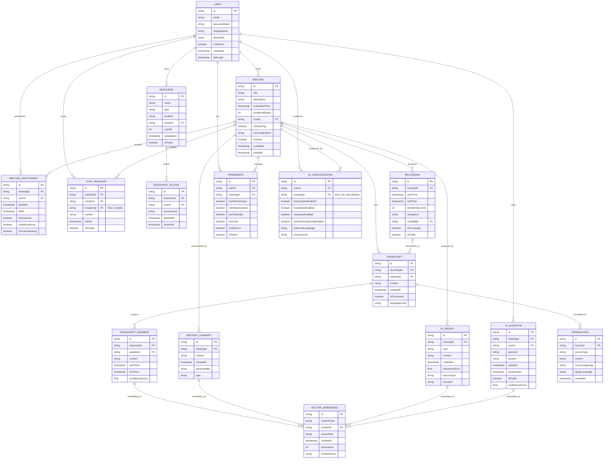

# Database Schema Design

## Entity-Relationship Diagram (ERD)



## Schema Implementation Notes

### Users Collection

```javascript
{
  id: "user123",
  email: "teacher@example.com",
  displayName: "Professor Smith",
  photoURL: "https://storage.example.com/profiles/user123.jpg",
  isTeacher: true,
  passwordHash: "$2a$10$...", // Bcrypt hash
  createdAt: "2025-04-10T15:00:00Z",
  lastLogin: "2025-05-12T09:30:00Z",
  preferences: {
    theme: "light",
    notifications: {
      email: true,
      inApp: true
    },
    ai: {
      transcriptionEnabled: true,
      translationEnabled: false,
      preferredLanguage: "en-US",
      privacyLevel: "standard"  // standard, enhanced, minimum
    }
  },
  institutionId: "inst456"
}
```

### Meetings Collection

```javascript
{
  id: "meet789",
  title: "Introduction to Computer Science",
  description: "First lecture of the semester covering course overview",
  scheduledTime: "2025-05-15T14:00:00Z",
  durationMinutes: 90,
  hostId: "user123",
  isRecurring: true,
  recurringPattern: "WEEKLY",
  isActive: false,
  createdAt: "2025-05-01T10:00:00Z",
  endedAt: null,
  settings: {
    waitingRoom: true,
    recordingEnabled: true,
    chatEnabled: true,
    ai: {
      transcriptionEnabled: true,
      summaryEnabled: true,
      questionAnsweringEnabled: true,
      translationEnabled: false,
      insightsEnabled: true,
      contentAnalysisEnabled: true
    }
  },
  courseId: "cs101",
  meetingUrl: "https://learnmeet.com/join/meet789",
  password: "class2025" // Optional password protection
}
```

### Meeting Participants Collection

```javascript
{
  id: "mp456",
  meetingId: "meet789",
  userId: "student456",
  joinedAt: "2025-05-15T14:02:30Z",
  leftAt: "2025-05-15T15:30:00Z",
  hasCamera: true,
  hasMicrophone: true,
  isScreenSharing: false,
  deviceInfo: {
    browser: "Chrome 120.0",
    os: "Windows 11",
    networkQuality: "good"
  },
  connectionQuality: 85, // Percentage
  aiSettings: {
    transcriptionEnabled: true,
    translationEnabled: true,
    preferredLanguage: "es-ES"  // Override user default
  }
}
```

### Chat Messages Collection

```javascript
{
  id: "msg123",
  meetingId: "meet789",
  senderId: "student456",
  recipientId: null, // null means public message
  content: "Could you explain the last slide again?",
  sentAt: "2025-05-15T14:45:30Z",
  isPrivate: false,
  isQuestion: true,
  isAnswered: false,
  reactions: ["👍", "👍"], // Reactions from other participants
  aiAnalysis: {
    isQuestion: true,
    topics: ["slide explanation", "course material"],
    sentiment: "confused",
    priority: 0.8
  }
}
```

### Resources Collection

```javascript
{
  id: "res789",
  name: "Lecture Slides Week 1.pdf",
  type: "application/pdf",
  location: "storage/courses/cs101/slides/week1.pdf",
  ownerId: "user123",
  sizeKB: 2048,
  uploadedAt: "2025-05-10T11:30:00Z",
  isPublic: false,
  metadata: {
    pageCount: 45,
    thumbnail: "thumbnails/res789.jpg"
  },
  tags: ["introduction", "week1"],
  aiMetadata: {
    contentSummary: "Introduction to CS course covering syllabus, learning objectives, and basic concepts",
    extractedTopics: ["syllabus", "grading policy", "programming basics"],
    keyTerms: ["algorithm", "data structure", "computational complexity"],
    difficultyLevel: 0.3,  // 0-1 scale, 0 being simplest
    vectorEmbeddingId: "vec123"  // Reference to vector embedding for semantic search
  }
}
```

### Recordings Collection

```javascript
{
  id: "rec123",
  meetingId: "meet789",
  startTime: "2025-05-15T14:00:00Z",
  endTime: "2025-05-15T15:30:00Z",
  durationSeconds: 5400,
  storageUrl: "storage/recordings/meet789/rec123.mp4",
  createdBy: "user123",
  isProcessed: true,
  isPublic: false,
  format: "mp4",
  resolution: "720p",
  sizeKB: 102400,
  chapters: [
    { title: "Introduction", timestamp: 0 },
    { title: "Course Overview", timestamp: 600 },
    { title: "Q&A Session", timestamp: 3600 }
  ],
  transcriptionId: "trans123",  // Reference to transcript document
  aiProcessing: {
    status: "completed",  // pending, in-progress, completed, failed
    completedTasks: ["transcription", "summarization", "topic-extraction"],
    pendingTasks: [],
    errorMessages: []
  }
}
```

### Transcripts Collection

```javascript
{
  id: "trans123",
  recordingId: "rec123",
  meetingId: "meet789",
  content: "Full transcript text...",
  createdAt: "2025-05-15T15:45:00Z",
  isProcessed: true,
  languageCode: "en-US",
  metadata: {
    speakerCount: 5,
    wordCount: 8750,
    confidenceScore: 0.92
  }
}
```

### Transcript Segments Collection

```javascript
{
  id: "seg456",
  transcriptId: "trans123",
  speakerId: "user123",
  speakerName: "Professor Smith",
  content: "Today we'll be discussing the fundamentals of algorithms.",
  startTime: "2025-05-15T14:05:23Z",
  endTime: "2025-05-15T14:05:29Z",
  confidenceScore: 0.95,
  sentimentAnalysis: {
    sentiment: "neutral",
    confidence: 0.87
  },
  topicLabels: ["algorithms", "fundamentals"]
}
```

### Meeting Summaries Collection

```javascript
{
  id: "sum789",
  meetingId: "meet789",
  content: "This introductory lecture covered the course syllabus, grading policy, and a brief overview of core concepts including algorithms and data structures. Key points included the weekly assignment structure, examination dates, and project requirements. The professor emphasized the importance of attendance and participation. Several students asked questions about the programming environment setup and prerequisites.",
  createdAt: "2025-05-15T15:50:00Z",
  generatedBy: "gemini-1.5-pro",
  type: "complete",  // complete, brief, key-points, action-items
  metadata: {
    wordCount: 150,
    keyTopics: [
      "course syllabus", 
      "grading policy", 
      "assignments", 
      "exams"
    ],
    importantMoments: [
      { topic: "Project Requirements", timestamp: "2025-05-15T14:35:00Z" },
      { topic: "Student Questions", timestamp: "2025-05-15T15:10:00Z" }
    ],
    confidenceScore: 0.89
  }
}
```

### AI Insights Collection

```javascript
{
  id: "ins345",
  meetingId: "meet789",
  type: "engagement-metric",
  content: {
    overallEngagement: 0.78,  // 0-1 scale
    attentionHotspots: [
      { time: "2025-05-15T14:20:00Z", score: 0.92, duration: 300, topic: "Practical Examples" },
      { time: "2025-05-15T15:05:00Z", score: 0.65, duration: 180, topic: "Technical Details" }
    ],
    participationMetrics: {
      questionsAsked: 12,
      studentsParticipated: 8,
      averageResponseTime: 35  // seconds
    },
    suggestions: [
      "Consider adding more practical examples when discussing technical concepts.",
      "The pace during the algorithm explanation section could be reduced."
    ]
  },
  createdAt: "2025-05-15T15:55:00Z",
  relevanceScore: 0.85,
  sourceType: "transcript",
  sourceId: "trans123"
}
```

### AI Questions Collection

```javascript
{
  id: "q123",
  meetingId: "meet789",
  userId: "student456",
  question: "Can you explain the difference between O(n) and O(n²) time complexity?",
  answer: "O(n) and O(n²) are different time complexity notations that describe how an algorithm's performance scales with input size. O(n) means the processing time grows linearly with input size - doubling the input roughly doubles the time. This is common in algorithms that process each input element once, like simple loops. O(n²) means the processing time grows quadratically - doubling the input roughly quadruples the time. This typically happens in algorithms with nested loops, where for each element, you process all elements again. O(n) algorithms are generally more efficient than O(n²) for large inputs.",
  askedAt: "2025-05-15T14:40:00Z",
  answeredAt: "2025-05-15T14:40:03Z",
  isPublic: true,
  confidenceScore: 0.94,
  metadata: {
    relatedTopics: ["algorithms", "computational complexity", "efficiency"],
    relatedResources: ["res789"],
    followUpQuestions: [
      "Can you give examples of O(n) and O(n²) algorithms?",
      "How do I determine the time complexity of my own code?"
    ],
    feedbackRating: 4.5,  // 1-5 scale if user provided feedback
    answerSources: ["course-material", "general-knowledge"]
  }
}
```

### AI Configuration Collection

```javascript
{
  id: "cfg456",
  userId: "user123",
  meetingId: "meet789",  // null for user default settings
  transcriptionEnabled: true,
  translationEnabled: false,
  summaryEnabled: true,
  questionAnsweringEnabled: true,
  preferredLanguage: "en-US",
  privacyLevel: "standard", // minimal, standard, enhanced
  modelPreferences: {
    summaryLength: "medium",  // brief, medium, detailed
    insightTypes: ["engagement", "comprehension", "participation"],
    questionThreshold: 0.7,  // confidence threshold for answering questions
    contentFilters: {
      profanityFilter: true,
      sensitiveTopicFilter: true
    }
  },
  createdAt: "2025-05-01T10:30:00Z",
  updatedAt: "2025-05-10T15:45:00Z"
}
```

### Vector Embeddings Collection

```javascript
{
  id: "vec123",
  contentType: "transcript-segment",
  contentId: "seg456",
  vectorData: "[0.232, 0.145, 0.876, ...]", // Compressed or serialized vector
  createdAt: "2025-05-15T15:55:00Z",
  dimensions: 1024,
  modelVersion: "gemini-1.5-embed-1", // Embedding model version
  metadata: {
    contextWindow: {
      before: "seg455",
      after: "seg457"
    },
    semanticLabels: ["teaching", "computer-science", "algorithms"],
    searchScore: 0.92  // Pre-computed relevance for common queries
  }
}
```

### Translations Collection

```javascript
{
  id: "tr789",
  sourceId: "seg456",
  sourceType: "transcript-segment",
  content: "Hoy hablaremos de los fundamentos de los algoritmos.",
  sourceLanguage: "en-US",
  targetLanguage: "es-ES",
  createdAt: "2025-05-15T14:05:30Z",
  metadata: {
    confidenceScore: 0.89,
    generatedBy: "gemini-1.5-pro",
    translationQuality: "high", // auto-assessment of translation quality
    reviewed: false
  }
}
```
