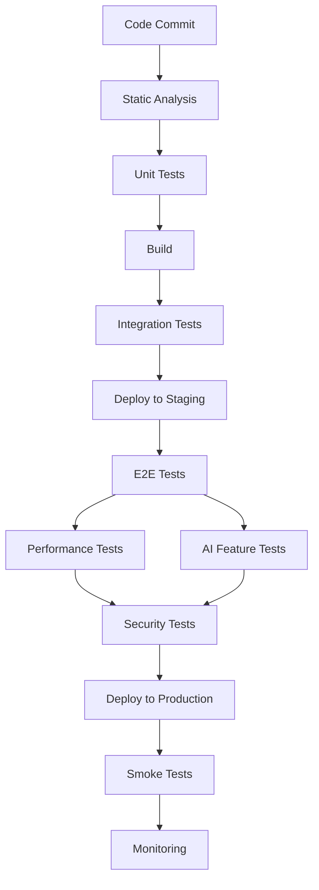

# Testing Strategy for LearnMeet

## Overview

This document outlines the comprehensive testing strategy for the LearnMeet platform. The goal is to ensure high quality, reliability, and performance across all features and components of the application.

## Testing Pyramid

Our testing approach follows the testing pyramid model to balance coverage, execution speed, and maintenance costs:

```
    /\
   /  \
  /    \
 / E2E  \
/--------\
/  INT    \
/----------\
/    UNIT    \
--------------
```

1. **Unit Tests**: Fast, focused tests for individual functions and components
2. **Integration Tests**: Testing how components work together
3. **End-to-End Tests**: Full workflow testing from the user perspective

## Test Types

### 1. Unit Testing

**Scope**: Individual functions, components, and modules

**Tools**:
- Vitest - Test runner
- Testing Library - Component testing
- MSW (Mock Service Worker) - API mocking

**Areas Covered**:
- UI Components
- Store operations
- Utility functions
- Service interfaces
- AI utility functions

**Example Test Cases**:
```typescript
// Button component test
test('Button renders correctly with props', () => {
  const { getByText } = render(Button, {
    props: {
      variant: 'primary',
      size: 'md'
    }
  });
  
  const button = getByText('Click me');
  expect(button).toBeInTheDocument();
  expect(button).toHaveClass('btn-primary');
  expect(button).toHaveClass('btn-md');
});

// Auth store test
test('authStore.signIn updates state correctly on success', async () => {
  // Mock API response
  const mockUser = { id: '123', email: 'test@example.com', displayName: 'Test User' };
  mockApi.onPost('/auth/login').reply(200, { user: mockUser });
  
  // Call the store action
  await authStore.signIn('test@example.com', 'password');
  
  // Get the final state
  const state = get(authStore);
  
  expect(state.user).toEqual(mockUser);
  expect(state.isAuthenticated).toBe(true);
  expect(state.loading).toBe(false);
  expect(state.error).toBe(null);
});

// AI service unit test
test('aiService.summarizeTranscript returns concise summary', async () => {
  // Mock Gemini API response
  mockGeminiApi.onPost('/summarize').reply(200, { 
    summary: 'This is a summary of the lecture.'
  });
  
  // Call the AI service
  const result = await aiService.summarizeTranscript('Long transcript text...');
  
  expect(result.summary).toBe('This is a summary of the lecture.');
  expect(mockGeminiApi.history.post[0].data).toContain('Long transcript text...');
});
```

**Coverage Target**: 80% statement coverage

### 2. Integration Testing

**Scope**: Interactions between multiple components or services

**Tools**:
- Vitest
- Playwright Component Testing
- Pact (for API contract testing)

**Areas Covered**:
- Form submissions and validation
- Data flow between components
- API integrations
- State management across features
- AI service integration with application components

**Example Test Cases**:
```typescript
// Login form integration test
test('Login form submission calls API and updates UI', async () => {
  // Setup mocks
  mockApi.onPost('/auth/login').reply(200, { 
    user: { id: '123', email: 'test@example.com' }
  });
  
  // Render the form
  const { getByLabelText, getByRole } = render(LoginForm);
  
  // Fill out the form
  await userEvent.type(getByLabelText('Email'), 'test@example.com');
  await userEvent.type(getByLabelText('Password'), 'password');
  
  // Submit the form
  await userEvent.click(getByRole('button', { name: 'Sign In' }));
  
  // Check that API was called
  expect(mockApi.history.post).toHaveLength(1);
  
  // Check that UI updated appropriately
  await waitFor(() => {
    expect(getByRole('alert')).toHaveTextContent('Login successful');
  });
});

// AI assistant integration test
test('AI assistant processes questions and displays responses', async () => {
  // Setup mocks
  mockGeminiApi.onPost('/generate').reply(200, {
    response: 'The answer to your question is...'
  });
  
  // Render the AI assistant component
  const { getByPlaceholderText, getByRole, findByText } = render(AIAssistantPanel);
  
  // Type a question
  await userEvent.type(getByPlaceholderText('Ask a question...'), 'What is WebRTC?');
  
  // Submit the question
  await userEvent.click(getByRole('button', { name: 'Send' }));
  
  // Check loading state
  expect(getByRole('status')).toBeInTheDocument();
  
  // Check that response is displayed
  const response = await findByText('The answer to your question is...');
  expect(response).toBeInTheDocument();
  
  // Check that API was called with correct context
  expect(mockGeminiApi.history.post[0].data).toContain('What is WebRTC?');
});
```

**Coverage Target**: 70% integration coverage of critical paths

### 3. End-to-End Testing

**Scope**: Full user workflows across the entire application

**Tools**:
- Playwright
- Cypress

**Areas Covered**:
- User registration and authentication
- Meeting creation and joining
- Video conferencing core functionality
- Resource sharing and management
- AI-assisted teaching and learning workflows

**Example Test Cases**:
```typescript
// E2E test for meeting creation and joining
test('User can create a meeting and another user can join it', async ({ page, browser }) => {
  // Login as first user
  await page.goto('/login');
  await page.fill('[name="email"]', 'teacher@example.com');
  await page.fill('[name="password"]', 'password');
  await page.click('button[type="submit"]');
  
  // Create a new meeting
  await page.goto('/meetings/new');
  await page.fill('[name="title"]', 'Test Meeting');
  await page.click('button:has-text("Create Meeting")');
  
  // Get meeting URL
  const meetingUrl = await page.url();
  
  // Create second browser context and page
  const secondContext = await browser.newContext();
  const secondPage = await secondContext.newPage();
  
  // Login as second user
  await secondPage.goto('/login');
  await secondPage.fill('[name="email"]', 'student@example.com');
  await secondPage.fill('[name="password"]', 'password');
  await secondPage.click('button[type="submit"]');
  
  // Join the meeting
  await secondPage.goto(meetingUrl);
  
  // Verify both users are in the meeting
  await expect(page.locator('.participant')).toHaveCount(2);
  await expect(secondPage.locator('.participant')).toHaveCount(2);
});

// E2E test for AI transcription and summarization
test('Meeting is transcribed and summarized by AI', async ({ page }) => {
  // Login and join meeting
  await loginAndJoinMeeting(page, 'teacher@example.com', 'password', 'meet123');
  
  // Enable recording with transcription
  await page.click('button[aria-label="Start recording"]');
  await page.click('text=Enable AI transcription');
  await page.click('button:has-text("Start")');
  
  // Verify transcription is active
  await expect(page.locator('.transcription-indicator')).toBeVisible();
  
  // Simulate speaking (mock audio in test environment)
  await simulateSpeaking(page, 'This is a test lecture about artificial intelligence.');
  
  // Wait for transcription to appear
  await expect(page.locator('.transcript-content')).toContainText('artificial intelligence');
  
  // End meeting
  await page.click('button:has-text("End Meeting")');
  
  // Check meeting summary is generated
  await page.goto('/meetings/past');
  await page.click('text=Test Meeting');
  
  // Verify AI summary is present
  await expect(page.locator('.meeting-summary')).toBeVisible();
  await expect(page.locator('.meeting-summary')).toContainText('Summary');
});
```

**Coverage Target**: Cover all critical user workflows

### 4. Performance Testing

**Scope**: Application performance under various conditions

**Tools**:
- Lighthouse
- JMeter
- Custom WebRTC performance tools
- AI response time measurement tools

**Areas Covered**:
- Page load times
- Time to interactive
- Video/audio quality metrics
- Concurrent user capacity
- AI response latency
- Model processing time

**Example Test Cases**:
```
// Load testing scenario
1. Simulate 50 concurrent users joining a meeting over 2 minutes
2. Each user sends/receives audio and video
3. Monitor server CPU, memory, bandwidth usage
4. Measure median and p95 latency for various operations
5. Verify no degradation in video quality
```

**AI-specific Performance Tests**:
```
// AI performance test scenario
1. Simulate 10 concurrent AI requests (transcription, summarization)
2. Measure response time for each request type
3. Monitor token usage and API rate limits
4. Test failover and degradation scenarios
5. Benchmark against target latency thresholds
```

**Performance Targets**:
- First contentful paint < 1.5s
- Time to interactive < 3s
- Meeting join time < 5s
- Support 100 concurrent users per meeting
- Video latency < 500ms
- AI response time < 2s for standard queries
- Transcription lag < 3s behind speech

### 5. Security Testing

**Scope**: Security vulnerabilities and data protection

**Tools**:
- OWASP ZAP
- SonarQube
- npm audit
- Penetration testing tools
- AI prompt injection testing tools

**Areas Covered**:
- Authentication and authorization
- Input validation and sanitization
- Protection against common web vulnerabilities
- Data encryption at rest and in transit
- AI-specific security vulnerabilities

**Example Test Cases**:
```
// Security test scenarios
1. Attempt to access protected resources without authentication
2. Test for SQL injection in search fields
3. Check for XSS vulnerabilities in chat messages
4. Verify proper TLS implementation
5. Test rate limiting on authentication endpoints
```

**AI-specific Security Tests**:
```
// AI security test scenarios
1. Test for prompt injection vulnerabilities
2. Verify rate limiting on AI API endpoints
3. Test for sensitive data leakage in AI responses
4. Verify API key security and rotation
5. Test AI response filtering for inappropriate content
```

**Security Standards**:
- OWASP Top 10 compliance
- GDPR data protection requirements
- Industry-standard encryption
- AI security best practices

### 6. Accessibility Testing

**Scope**: Compliance with accessibility standards

**Tools**:
- axe-core
- Lighthouse Accessibility
- Manual testing with screen readers

**Areas Covered**:
- WCAG 2.1 AA compliance
- Keyboard navigation
- Screen reader compatibility
- Color contrast and readability
- AI-generated content accessibility

**Example Test Cases**:
```typescript
// Accessibility test example
test('Meeting controls are accessible', async () => {
  const results = await runAxe('#meeting-controls');
  expect(results.violations).toHaveLength(0);
  
  // Test keyboard navigation
  await userEvent.tab();
  expect(document.activeElement).toHaveAttribute('aria-label', 'Mute microphone');
  await userEvent.tab();
  expect(document.activeElement).toHaveAttribute('aria-label', 'Turn off camera');
});

// AI-generated content accessibility test
test('AI-generated content meets accessibility standards', async () => {
  // Render component with AI-generated content
  const { container } = render(AIContentDisplay, {
    props: {
      content: 'AI-generated explanation of a complex topic...'
    }
  });
  
  // Run accessibility checks
  const results = await runAxe(container);
  expect(results.violations).toHaveLength(0);
  
  // Check reading level is appropriate
  const readabilityScore = getReadabilityScore(container.textContent);
  expect(readabilityScore).toBeLessThan(12); // Grade level appropriate for target audience
});
```

**Accessibility Target**: WCAG 2.1 AA compliance

### 7. AI Feature Testing

**Scope**: Functionality and quality of AI-enhanced features

**Tools**:
- Custom AI testing framework
- Gemini API simulation tools
- Conversation evaluation metrics
- Content quality assessment tools

**Areas Covered**:
- Transcription accuracy
- Summarization quality
- Translation fidelity
- Context awareness
- Response appropriateness
- Educational value

**Example Test Cases**:
```typescript
// AI transcription accuracy test
test('AI transcription achieves minimum accuracy threshold', async () => {
  // Load test audio file with known transcript
  const testAudio = await loadTestAudio('lecture-sample.mp3');
  const knownTranscript = await loadFile('lecture-sample-transcript.txt');
  
  // Process through transcription pipeline
  const result = await transcriptionService.transcribe(testAudio);
  
  // Calculate Word Error Rate
  const wer = calculateWER(result.transcript, knownTranscript);
  expect(wer).toBeLessThan(0.15); // Less than 15% word error rate
});

// AI summarization quality test
test('AI summarization captures key points', async () => {
  // Test transcript with known key points
  const transcript = await loadFile('test-lecture-transcript.txt');
  const keyPoints = ['concept A', 'principle B', 'methodology C'];
  
  // Generate summary
  const summary = await aiService.summarizeLecture(transcript);
  
  // Verify key points are included
  for (const point of keyPoints) {
    expect(summary).toContain(point);
  }
  
  // Verify summary is concise (significantly shorter than transcript)
  expect(summary.length).toBeLessThan(transcript.length * 0.2);
});

// AI teaching assistant conversation test
test('AI teaching assistant provides relevant responses', async () => {
  // Setup conversation context
  const courseContext = {
    subject: 'Computer Science',
    topic: 'Data Structures',
    level: 'Undergraduate'
  };
  
  // Test questions with expected answer criteria
  const testCases = [
    {
      question: 'What is the time complexity of quicksort?',
      expectToContain: ['O(n log n)', 'worst case', 'O(n²)']
    },
    {
      question: 'Can you explain binary search trees?',
      expectToContain: ['left subtree', 'right subtree', 'search', 'insert']
    }
  ];
  
  for (const testCase of testCases) {
    // Get AI response
    const response = await aiAssistant.answer(testCase.question, courseContext);
    
    // Check for expected content
    for (const expectedPhrase of testCase.expectToContain) {
      expect(response.toLowerCase()).toContain(expectedPhrase.toLowerCase());
    }
    
    // Check educational value score
    const educationalValue = await evaluateEducationalValue(response);
    expect(educationalValue).toBeGreaterThan(7); // Scale of 1-10
  }
});
```

**AI Quality Targets**:
- Transcription Word Error Rate (WER) < 15%
- Summarization content coverage > 85%
- Question answering relevance score > 80%
- Educational value rating > 7/10
- Response time < 2 seconds for 90% of requests

## Testing Environments

### 1. Local Development

- Developer's local machine
- Mock APIs and services
- Focus on unit and component tests
- Simulated AI responses

### 2. Development Environment

- Shared development server
- Integration with test APIs
- Automated test runs on pull requests
- Sandbox AI credentials with quotas

### 3. Staging Environment

- Mirror of production configuration
- Full integration with all services
- Performance and security testing
- Production-equivalent AI API access

### 4. Production Environment

- Limited smoke tests
- Canary deployments
- Real user monitoring
- Production AI API with monitoring

## Continuous Integration Process



**Process Details**:
1. Developer commits code and creates pull request
2. CI pipeline runs static analysis and unit tests
3. On success, build artifact is created
4. Integration tests run against the build
5. If successful, deploy to staging environment
6. Run E2E, performance, AI feature, and security tests in staging
7. Manual QA review (if needed)
8. Deploy to production with canary release
9. Run smoke tests in production
10. Monitor performance and errors

## Test Data Management

### Approaches:
1. **Fixed test data**: Pre-defined data for specific test scenarios
2. **Generated test data**: Dynamically created using factories
3. **Anonymized production data**: For performance testing
4. **AI training data**: Curated datasets for testing AI features

### Practices:
- Reset test data between test runs
- Isolate test environments
- Use unique identifiers for test resources
- Document data dependencies
- Maintain diverse AI test datasets representing various accents, topics, and scenarios

## Bug Tracking and Reporting

**Process**:
1. Bug discovered in testing or reported by user
2. Bug logged with reproduction steps, environment, and severity
3. Bug triaged and prioritized
4. Bug assigned to developer
5. Fix implemented with unit test
6. Fix verified by QA
7. Bug closed

**Bug Report Template**:
```
Title: [Concise description of issue]

Environment:
- Browser/Device:
- OS:
- App Version:

Steps to Reproduce:
1.
2.
3.

Expected Result:

Actual Result:

Screenshots/Videos:

Severity: [Critical/High/Medium/Low]

Additional Notes:
```

**AI-Specific Bug Report Fields**:
```
AI Feature: [Transcription/Summarization/Translation/etc.]
Input Content: [Description or excerpt of content that caused issue]
AI Response: [The problematic response]
Model Version: [Gemini version]
```

## Test Automation Strategy

### Automated Test Selection:
- Unit tests for all business logic and UI components
- Integration tests for critical component interactions
- E2E tests for core user journeys
- Performance tests for key screens and operations
- AI feature tests for all AI-enhanced capabilities

### Manual Test Focus:
- Exploratory testing
- UX evaluation
- Accessibility verification
- Edge cases
- Complex workflows
- AI response quality assessment
- Educational value evaluation

### Test Automation Tools:
- Jest/Vitest for unit and integration tests
- Playwright for E2E tests
- GitHub Actions for CI/CD pipeline
- Custom AI evaluation frameworks
- Custom reporting and dashboards

## Test Metrics and Reporting

**Key Metrics**:
- Test coverage percentage
- Pass/fail rates
- Test execution time
- Bug detection by test phase
- Regression rate
- AI feature quality metrics (accuracy, relevance, etc.)
- AI response time

**Reporting**:
- Automated reports after each CI run
- Weekly test summary for stakeholders
- Bug trends and analysis
- Test coverage dashboards
- AI feature quality dashboards

## Documentation

**Test Documentation**:
- Test strategy (this document)
- Test plans for major features
- Test case repository
- Testing guidelines and best practices
- Test environment setup instructions
- AI testing guidelines and benchmarks

## Conclusion

This testing strategy aims to ensure comprehensive quality assurance for the LearnMeet platform, including its AI-enhanced features. By implementing multiple testing types across various environments, we can deliver a robust, performant, and user-friendly online learning experience that effectively leverages AI to improve educational outcomes.
