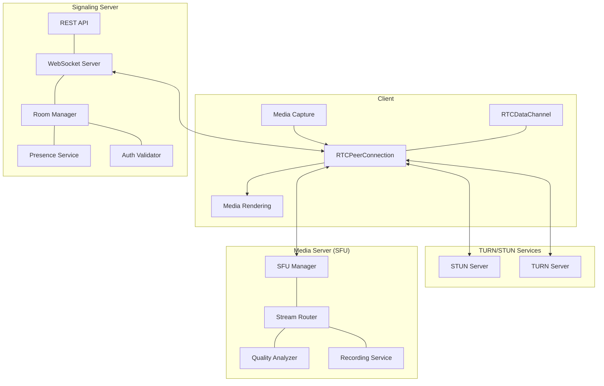
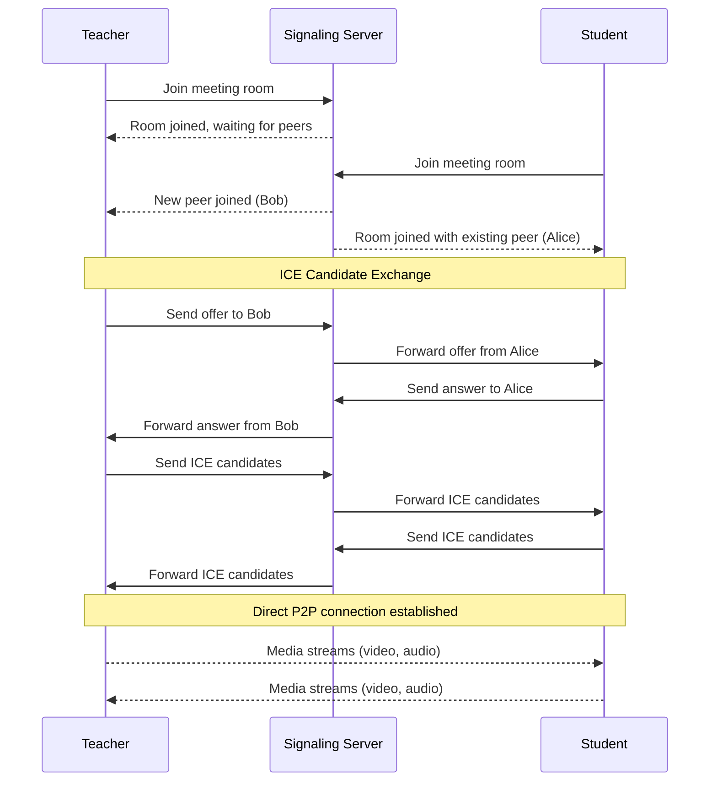
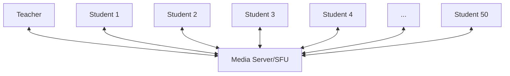
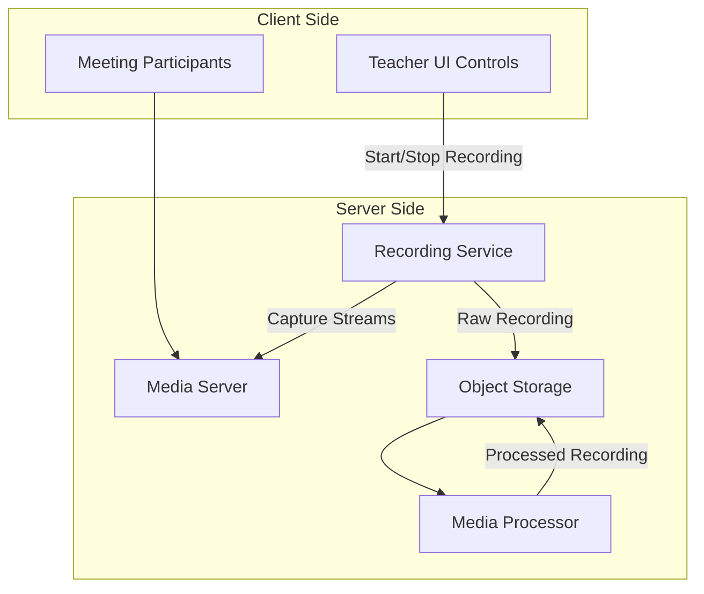
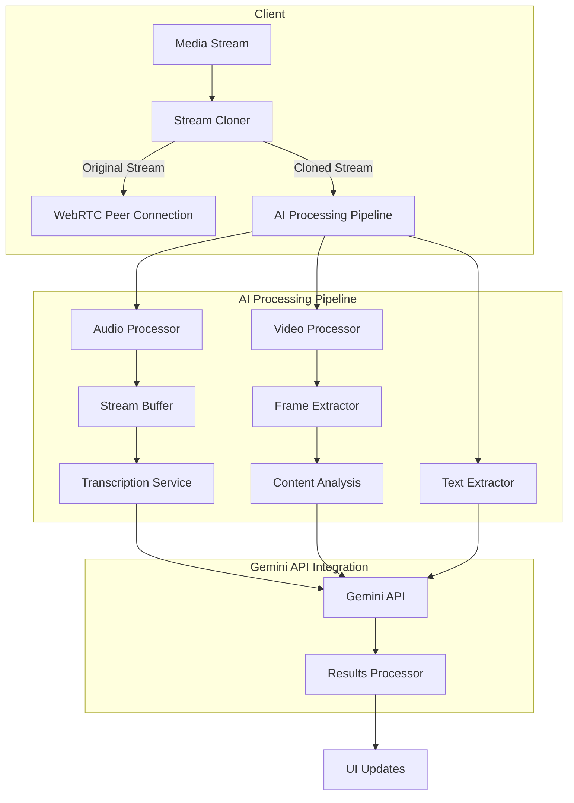

# WebRTC Architecture for LearnMeet

## Overview

This document outlines the WebRTC architecture for the LearnMeet platform, focusing on implementing reliable, scalable video conferencing capabilities for educational environments. The architecture addresses key challenges such as signaling, peer connection management, media optimization, and scalability for high-concurrency classrooms.

## WebRTC Basics

WebRTC (Web Real-Time Communication) is an open-source project that provides browsers and mobile applications with Real-Time Communications (RTC) capabilities via simple APIs. The key components include:

1. **MediaStream (getUserMedia)**: Captures audio and video
2. **RTCPeerConnection**: Establishes peer-to-peer connections
3. **RTCDataChannel**: Enables peer-to-peer data exchange

## Architecture Diagram



## Connection Flow



## Signaling Service

The signaling service facilitates the exchange of session description protocols (SDP) and ICE candidates between peers.

### Key Components:

1. **WebSocket Server**:
   - Maintains persistent connections with clients
   - Low latency message delivery
   - Uses Socket.IO for reliability and fallback options

2. **Room Manager**:
   - Tracks active meetings/rooms
   - Manages participant lists
   - Handles join/leave events

3. **Authentication Layer**:
   - Validates access tokens
   - Enforces room permissions
   - Prevents unauthorized access

### Implementation:

```typescript
// Server-side signaling implementation (simplified)
io.on('connection', (socket) => {
  // Authentication
  const token = socket.handshake.auth.token;
  const user = validateToken(token);
  if (!user) {
    socket.disconnect();
    return;
  }
  
  // Join room
  socket.on('join-room', async (roomId, callback) => {
    try {
      // Check room permissions
      const hasAccess = await checkAccess(user, roomId);
      if (!hasAccess) {
        return callback({ error: 'Access denied' });
      }
      
      // Join Socket.IO room
      socket.join(roomId);
      
      // Notify others in the room
      socket.to(roomId).emit('user-joined', {
        userId: user.id,
        displayName: user.displayName,
        timestamp: Date.now()
      });
      
      // Get list of participants
      const participants = getRoomParticipants(roomId);
      callback({ participants });
      
      // Track user in room
      addParticipantToRoom(roomId, user.id, socket.id);
    } catch (error) {
      callback({ error: error.message });
    }
  });
  
  // Handle signaling
  socket.on('signal', ({ to, signal }) => {
    io.to(to).emit('signal', {
      from: socket.id,
      signal
    });
  });
  
  // Handle disconnection
  socket.on('disconnect', () => {
    const rooms = getUserRooms(socket.id);
    rooms.forEach(roomId => {
      socket.to(roomId).emit('user-left', {
        userId: user.id,
        timestamp: Date.now()
      });
      removeParticipantFromRoom(roomId, user.id);
    });
  });
});
```

## Peer Connection Management

### Client-Side Implementation

```typescript
class PeerConnectionManager {
  private peerConnections: Map<string, RTCPeerConnection> = new Map();
  private localStream: MediaStream | null = null;
  private dataChannels: Map<string, RTCDataChannel> = new Map();
  private iceServers: RTCIceServer[];
  
  constructor(iceServers: RTCIceServer[]) {
    this.iceServers = iceServers;
  }
  
  async initLocalStream(constraints: MediaStreamConstraints): Promise<MediaStream> {
    this.localStream = await navigator.mediaDevices.getUserMedia(constraints);
    return this.localStream;
  }
  
  createPeerConnection(peerId: string): RTCPeerConnection {
    if (this.peerConnections.has(peerId)) {
      return this.peerConnections.get(peerId)!;
    }
    
    const pc = new RTCPeerConnection({ iceServers: this.iceServers });
    
    // Add local tracks to the peer connection
    if (this.localStream) {
      this.localStream.getTracks().forEach(track => {
        pc.addTrack(track, this.localStream!);
      });
    }
    
    // Handle ICE candidates
    pc.onicecandidate = event => {
      if (event.candidate) {
        signalService.sendICECandidate(peerId, event.candidate);
      }
    };
    
    // Handle connection state changes
    pc.onconnectionstatechange = event => {
      switch(pc.connectionState) {
        case 'connected':
          // Peers connected!
          break;
        case 'disconnected':
        case 'failed':
          // Handle connection failure
          this.closePeerConnection(peerId);
          break;
      }
    };
    
    // Handle incoming tracks
    pc.ontrack = event => {
      const stream = event.streams[0];
      // Emit event for UI to render the remote stream
      this.emit('track', { peerId, stream });
    };
    
    // Create data channel
    const dataChannel = pc.createDataChannel('chat');
    this.setupDataChannel(dataChannel, peerId);
    
    // Store the connection
    this.peerConnections.set(peerId, pc);
    return pc;
  }
  
  async createOffer(peerId: string): Promise<RTCSessionDescriptionInit> {
    const pc = this.createPeerConnection(peerId);
    const offer = await pc.createOffer();
    await pc.setLocalDescription(offer);
    return offer;
  }
  
  async handleOffer(peerId: string, offer: RTCSessionDescriptionInit): Promise<RTCSessionDescriptionInit> {
    const pc = this.createPeerConnection(peerId);
    await pc.setRemoteDescription(new RTCSessionDescription(offer));
    const answer = await pc.createAnswer();
    await pc.setLocalDescription(answer);
    return answer;
  }
  
  async handleAnswer(peerId: string, answer: RTCSessionDescriptionInit): Promise<void> {
    const pc = this.peerConnections.get(peerId);
    if (pc) {
      await pc.setRemoteDescription(new RTCSessionDescription(answer));
    }
  }
  
  async addIceCandidate(peerId: string, candidate: RTCIceCandidate): Promise<void> {
    const pc = this.peerConnections.get(peerId);
    if (pc) {
      await pc.addIceCandidate(new RTCIceCandidate(candidate));
    }
  }
  
  closePeerConnection(peerId: string): void {
    const pc = this.peerConnections.get(peerId);
    if (pc) {
      pc.close();
      this.peerConnections.delete(peerId);
    }
    
    const dc = this.dataChannels.get(peerId);
    if (dc) {
      dc.close();
      this.dataChannels.delete(peerId);
    }
  }
  
  // Additional methods for managing streams, etc.
}
```

## Scalable Architecture for Classrooms

### Challenges with Pure P2P

In a pure peer-to-peer model, the number of connections grows quadratically with the number of participants:
- 3 participants = 3 connections
- 10 participants = 45 connections
- 25 participants = 300 connections
- 50 participants = 1,225 connections

This quickly becomes untenable for both bandwidth and processing power.

### Selective Forwarding Unit (SFU) Approach

For educational environments with many participants, we'll implement an SFU architecture:



**Benefits:**
- Each client maintains only one connection
- Server handles the routing of media streams
- Easier to implement advanced features like recording
- Better bandwidth utilization

### Implementation Strategy

1. **MediaSoup Integration**:
   - Open-source WebRTC SFU
   - Supports simulcast and SVC
   - Flexible API for custom routing logic

2. **Dynamic Stream Management**:
   ```javascript
   // Server-side routing logic (simplified)
   function routeVideoStream(producerId, consumer) {
     // Determine optimal layer based on role and network
     let layer;
     
     if (consumer.role === 'active-speaker' || consumer.role === 'pinned') {
       // High quality for active speakers or pinned participants
       layer = 'high';
     } else if (consumer.role === 'thumbnail') {
       // Medium quality for visible thumbnails
       layer = 'medium';
     } else {
       // Low quality or paused for others
       layer = consumer.bandwidth > LOW_BANDWIDTH_THRESHOLD ? 'low' : null;
     }
     
     if (layer === null) {
       // Pause the consumer to save bandwidth
       consumer.pause();
     } else {
       consumer.resume();
       consumer.preferredLayers = { spatialLayer: layerMapping[layer] };
     }
   }
   ```

3. **Role-Based Priorities**:
   - Teacher streams always get highest priority
   - Active speakers get medium-high priority
   - Students who recently participated get medium priority
   - Inactive students get lowest priority

## Media Optimization

### Simulcast and Scalable Video Coding

```
+-----------------+
| High Resolution |
|      1080p      |
+-----------------+
|  Med Resolution |
|       720p      |
+-----------------+
|  Low Resolution |
|       480p      |
+-----------------+
```

Each participant sends multiple quality levels of their video, allowing receivers to select the appropriate quality based on network conditions and UI requirements.

### Bandwidth Estimation

```typescript
class BandwidthEstimator {
  private readonly measurements: number[] = [];
  private lastCheckTime: number = 0;
  private bytesReceived: number = 0;
  
  constructor(private readonly windowSize: number = 5) {}
  
  addMeasurement(stats: RTCStatsReport): void {
    const now = performance.now();
    
    // Extract bytes received from stats
    let currentBytes = 0;
    stats.forEach(report => {
      if (report.type === 'inbound-rtp' && report.kind === 'video') {
        currentBytes += report.bytesReceived;
      }
    });
    
    if (this.lastCheckTime > 0) {
      const duration = (now - this.lastCheckTime) / 1000; // seconds
      const bytes = currentBytes - this.bytesReceived;
      const bitrate = (bytes * 8) / duration; // bits per second
      
      this.measurements.push(bitrate);
      if (this.measurements.length > this.windowSize) {
        this.measurements.shift();
      }
    }
    
    this.lastCheckTime = now;
    this.bytesReceived = currentBytes;
  }
  
  getEstimatedBandwidth(): number {
    if (this.measurements.length === 0) {
      return 0;
    }
    
    // Use a weighted average giving more weight to recent measurements
    let total = 0;
    let weightSum = 0;
    
    for (let i = 0; i < this.measurements.length; i++) {
      const weight = i + 1;
      total += this.measurements[i] * weight;
      weightSum += weight;
    }
    
    return total / weightSum;
  }
  
  getOptimalVideoQuality(): VideoQuality {
    const bandwidth = this.getEstimatedBandwidth();
    
    if (bandwidth > 2500000) { // 2.5 Mbps
      return { width: 1280, height: 720, frameRate: 30 };
    } else if (bandwidth > 1000000) { // 1 Mbps
      return { width: 854, height: 480, frameRate: 30 };
    } else if (bandwidth > 500000) { // 500 Kbps
      return { width: 640, height: 360, frameRate: 20 };
    } else {
      return { width: 426, height: 240, frameRate: 15 };
    }
  }
}
```

### CPU and Battery Optimization

```typescript
class ResourceManager {
  private readonly cpuUsage: number[] = [];
  private batteryLevel: number | null = null;
  
  async monitorResources(): Promise<void> {
    // Monitor CPU usage (where supported)
    try {
      if ('measureUserAgentSpecificMemory' in performance) {
        const usage = await performance.measureUserAgentSpecificMemory();
        this.updateCpuUsage(usage.bytes / 1000000); // Convert to MB
      }
    } catch (e) {
      console.warn('CPU monitoring not supported', e);
    }
    
    // Monitor battery status (where supported)
    try {
      if ('getBattery' in navigator) {
        const battery = await (navigator as any).getBattery();
        this.batteryLevel = battery.level * 100;
        
        battery.addEventListener('levelchange', () => {
          this.batteryLevel = battery.level * 100;
          this.optimizeResources();
        });
      }
    } catch (e) {
      console.warn('Battery monitoring not supported', e);
    }
    
    // Regularly optimize based on current readings
    setInterval(() => this.optimizeResources(), 30000);
  }
  
  private updateCpuUsage(usage: number): void {
    this.cpuUsage.push(usage);
    if (this.cpuUsage.length > 10) {
      this.cpuUsage.shift();
    }
  }
  
  getAverageCpuUsage(): number {
    if (this.cpuUsage.length === 0) return 0;
    return this.cpuUsage.reduce((sum, val) => sum + val, 0) / this.cpuUsage.length;
  }
  
  optimizeResources(): void {
    const avgCpu = this.getAverageCpuUsage();
    const lowBattery = this.batteryLevel !== null && this.batteryLevel < 20;
    
    // Apply optimizations based on resource constraints
    if (avgCpu > 80 || lowBattery) {
      // Reduce video quality
      this.applyLowResourceMode();
    } else if (avgCpu > 50) {
      // Moderate optimizations
      this.applyModerateResourceMode();
    } else {
      // Standard mode
      this.applyNormalResourceMode();
    }
  }
  
  // Implementation of different resource modes...
}
```

## Network Resilience

### ICE Configuration

```typescript
const iceConfig = {
  iceServers: [
    { urls: 'stun:stun.l.google.com:19302' },
    { urls: 'stun:stun1.l.google.com:19302' },
    { 
      urls: 'turn:turn.learnmeet.com:3478',
      username: 'username',
      credential: 'password'
    }
  ],
  iceTransportPolicy: 'all',
  iceCandidatePoolSize: 10
};
```

### Connection Recovery

```typescript
class ConnectionRecovery {
  private reconnectAttempts = 0;
  private readonly maxReconnectAttempts = 5;
  private backoffTime = 1000; // Start with 1s delay
  
  async handleDisconnection(peerId: string): Promise<boolean> {
    if (this.reconnectAttempts >= this.maxReconnectAttempts) {
      return false; // Give up after max attempts
    }
    
    try {
      // Wait with exponential backoff
      await new Promise(resolve => setTimeout(resolve, this.backoffTime));
      this.backoffTime *= 2; // Exponential backoff
      this.reconnectAttempts++;
      
      // Try to establish a new connection
      const success = await this.initiateReconnection(peerId);
      if (success) {
        this.resetRecoveryState();
        return true;
      }
      
      return await this.handleDisconnection(peerId);
    } catch (error) {
      console.error('Reconnection failed:', error);
      return false;
    }
  }
  
  private resetRecoveryState(): void {
    this.reconnectAttempts = 0;
    this.backoffTime = 1000;
  }
  
  // Implementation of reconnection logic
}
```

### Network Quality Monitoring

```typescript
class NetworkQualityMonitor {
  private readonly stats: Map<string, ConnectionStats> = new Map();
  
  startMonitoring(peerConnection: RTCPeerConnection, peerId: string): void {
    // Collect stats every second
    const interval = setInterval(async () => {
      try {
        const stats = await peerConnection.getStats();
        this.processStats(stats, peerId);
      } catch (error) {
        console.error('Error collecting stats:', error);
      }
    }, 1000);
    
    // Store the interval for cleanup
    this.stats.set(peerId, {
      interval,
      packetLoss: 0,
      jitter: 0,
      rtt: 0,
      bandwidth: 0,
      timestamp: Date.now()
    });
  }
  
  stopMonitoring(peerId: string): void {
    const connection = this.stats.get(peerId);
    if (connection?.interval) {
      clearInterval(connection.interval);
      this.stats.delete(peerId);
    }
  }
  
  processStats(stats: RTCStatsReport, peerId: string): void {
    let packetLoss = 0;
    let jitter = 0;
    let rtt = 0;
    let bandwidth = 0;
    
    stats.forEach(report => {
      if (report.type === 'inbound-rtp' && report.kind === 'video') {
        if (report.packetsLost && report.packetsReceived) {
          packetLoss = (report.packetsLost / (report.packetsLost + report.packetsReceived)) * 100;
        }
        if (report.jitter) {
          jitter = report.jitter * 1000; // Convert to ms
        }
      }
      
      if (report.type === 'candidate-pair' && report.state === 'succeeded') {
        if (report.currentRoundTripTime) {
          rtt = report.currentRoundTripTime * 1000; // Convert to ms
        }
        if (report.availableOutgoingBitrate) {
          bandwidth = report.availableOutgoingBitrate;
        }
      }
    });
    
    this.updateConnectionStats(peerId, { packetLoss, jitter, rtt, bandwidth });
  }
  
  updateConnectionStats(peerId: string, newStats: Partial<ConnectionStats>): void {
    const current = this.stats.get(peerId) || {
      packetLoss: 0,
      jitter: 0,
      rtt: 0,
      bandwidth: 0,
      timestamp: Date.now()
    };
    
    this.stats.set(peerId, {
      ...current,
      ...newStats,
      timestamp: Date.now()
    });
    
    // Emit quality score for UI
    const qualityScore = this.calculateQualityScore(peerId);
    this.emit('quality-update', { peerId, qualityScore });
  }
  
  calculateQualityScore(peerId: string): number {
    const stats = this.stats.get(peerId);
    if (!stats) return 0;
    
    // Calculate a score from 0-100 based on network metrics
    let score = 100;
    
    // Reduce score based on packet loss (0-5% = 0-50 point reduction)
    score -= Math.min(50, stats.packetLoss * 10);
    
    // Reduce score based on jitter (0-50ms = 0-15 point reduction)
    score -= Math.min(15, stats.jitter / 3.33);
    
    // Reduce score based on RTT (0-500ms = 0-20 point reduction)
    score -= Math.min(20, stats.rtt / 25);
    
    return Math.max(0, Math.min(100, Math.round(score)));
  }
}
```

## Meeting Recording

### Architecture



### Implementation Approach

1. **Server-side Recording**:
   - More reliable than client-side
   - Consistent quality regardless of teacher's connection
   - Reduces client resource usage

2. **Recording Process**:
   - Teacher initiates recording via UI
   - SFU captures composite view of all streams
   - Recording stored in cloud storage
   - Background processing for optimization and transcoding
   - Making recordings available for playback

3. **Storage and Retrieval**:
   - Recordings organized by course, meeting ID, and date
   - Access control based on course enrollment
   - Streaming playback with seeking capability
   - Optional download for offline viewing

## Accessibility Features

1. **Live Captions**:
   - Real-time transcription using WebSpeech API
   - Server-side speech recognition for better accuracy
   - Caption display synchronized with speaker

2. **Keyboard Navigation**:
   - Full control of meeting interface without mouse
   - Clear focus indicators
   - Keyboard shortcuts for common actions

3. **Screen Reader Support**:
   - ARIA labels for UI controls
   - Announcements for meeting events
   - Semantic HTML structure

## Security Considerations

1. **End-to-End Encryption**:
   - DTLS encryption for all WebRTC connections
   - TLS for signaling and control channels
   - Encrypted storage for recordings

2. **Access Control**:
   - Meeting access tokens with short expiry
   - Waiting room for participant verification
   - Room locking capability

3. **Privacy Measures**:
   - Background blurring option
   - Camera and microphone indicators
   - Permissions required for recording

## WebRTC Testing and Debugging

1. **WebRTC Internals**:
   - Using chrome://webrtc-internals for debugging
   - Stats collection and analysis
   - Connection state monitoring

2. **Automated Testing**:
   - Simulated peer connections for unit tests
   - Network condition simulation
   - Cross-browser compatibility testing

3. **Production Monitoring**:
   - WebRTC-specific metrics collection
   - User-reported issue correlation
   - Anomaly detection for quality issues

## AI Integration with WebRTC

### Media Stream Processing for AI Analysis

1. **Live Audio Processing Pipeline**:
   - Real-time audio stream cloning for AI processing
   - Web Audio API integration for audio preprocessing
   - Low-latency streaming to Gemini API
   - Buffering strategies for continuous transcription

2. **Video Frame Analysis**:
   - Selective frame extraction from video streams
   - Canvas-based frame processing
   - Content detection and classification
   - Privacy-preserving analysis options

3. **Data Synchronization**:
   - Timestamp correlation between streams and AI results
   - State management for multi-modal processing
   - Result aggregation and context building

### AI Processing Architecture



### Performance Considerations

1. **Bandwidth and CPU Management**:
   - Adaptive sampling rates for AI processing
   - Dynamic quality adjustment based on available resources
   - Background processing for non-critical AI features
   - Worker thread utilization for intensive processing

2. **Latency Optimization**:
   - Client-side preprocessing to reduce API payload size
   - Streaming API usage for progressive results
   - Edge processing for time-sensitive features
   - Intelligent caching of AI responses

3. **Fallback Mechanisms**:
   - Graceful degradation of AI features under load
   - Local processing options for basic features
   - Asynchronous processing for non-real-time features
   - Clear user communication about feature availability

### Privacy and Security

1. **Media Stream Protection**:
   - Explicit user consent for AI processing of media
   - Local preprocessing to anonymize data when possible
   - Minimal data transmission principle
   - Secure API communication with Gemini

2. **Data Handling**:
   - Temporary storage only as needed for processing
   - User control over what streams are analyzed
   - Clear activity indicators when AI is processing media
   - Compliance with educational privacy regulations

## Future Enhancements

1. **WebRTC Insertable Streams**:
   - Custom processing of media streams for AI pre-processing
   - Advanced effects and filters with AI assistance
   - Custom encryption layers with privacy-preserving analysis

2. **WebTransport Integration**:
   - More efficient than WebSockets for AI data transmission
   - Improved reliability for real-time AI analytics
   - Multiplexing AI data with control channels

3. **WebCodecs API**:
   - More control over encoding/decoding process for AI-optimized streams
   - Custom codec implementations with AI-assisted compression
   - Better adaptation to network conditions while maintaining AI processing quality

4. **Advanced AI Integration**:
   - On-device machine learning for latency-sensitive features
   - Custom AI models specialized for educational content
   - Federated learning approach for privacy-preserving improvements
   - Multi-modal fusion techniques for comprehensive understanding
